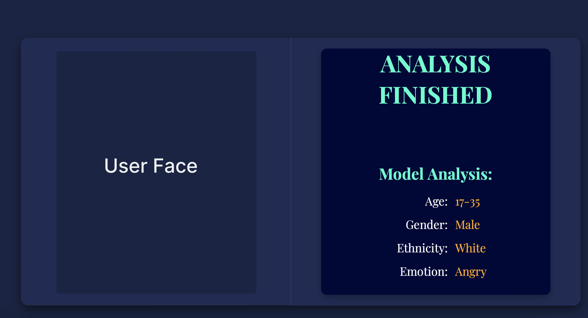
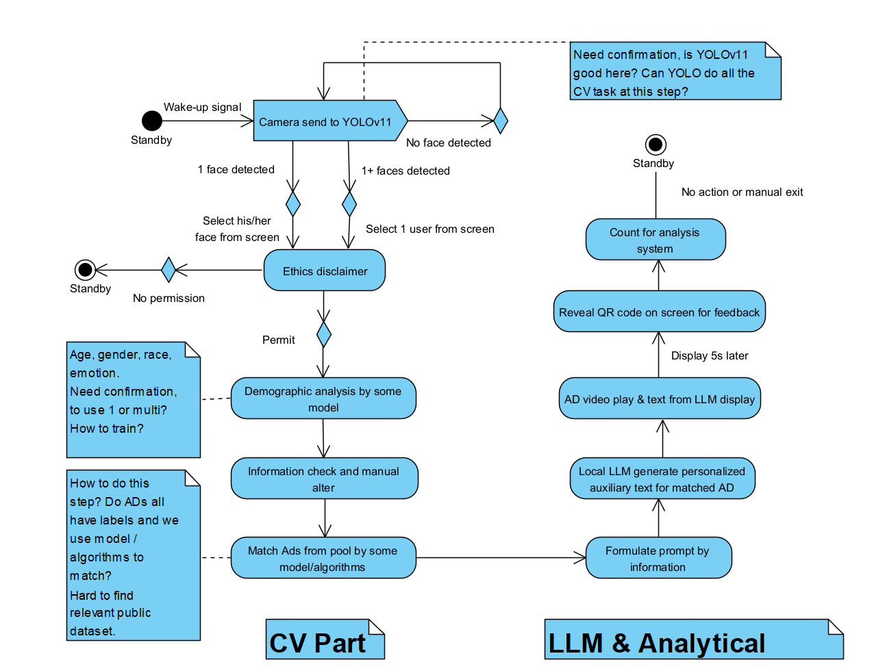

# AI-Powered Digital Signage
This repo is for [P2024‑08] AI‑Powered Digital Signage for Targeted and Personalized Advertisement.

## Introduction
This project aims to develop an AI digital signage capable of collecting users' facial and emotional data via a camera, enabling the recommendation of personalized advertisements tailored to individual preferences, thereby enhancing the fluidity and comfort of the shopping experience for users.

## How To Get Started
###  Configure the conda environment.
#### 1. Create new conda environment: 
Open the terminal on Mac or Anaconda Prompt on Windows and run the following command to create a new environment: 
```bash
conda create python=3.9
```
 ##### 2. Activate and deactivate the Environment:

 After creating the environment, activate it using the command:
 - Activate on MacOS/Linux/Windows
 ```bash
conda activate <project>
```
- Deactivate on MacOS/Linux/Windows
 ```bash
conda deactivate <project>
```
## How To Use
### Start up the project.
#### We have provided multiple entrance for user to execute the project
##### 1. For windows users, run the following command:
It is recommended to use the single-line format to avoid issues with line breaks.
 ```bash
pyinstaller --onefile --add-data ".env;." --add-data "CV;CV" --add-data "static\Videos;static\Videos" --add-data "data_integration\templates;data_integration\templates" --add-data "static;static" --add-data "advertisements.db;." state.py
```
Open PowerShell in the main folder's path, paste the command into it, and press Enter.
After this, open PowerShell as an administrator, then drag and drop the .exe file into the PowerShell window and press Enter.
When prompted to input an index, enter the corresponding index and press Enter to run the program.
##### 2. For Mac users:
Mac users should download our state executable file; however, it is typically recognized as a document. In this case, please refrain from opening it. Instead, in the current directory, execute the following command in the terminal:
 ```bash
chmod +x state
```
This command will extract it as a executable file, then users can click it. If a security warning is triggered and you are unable to open the file, please go to the settings and trust the file under "Privacy \& Security."  
##### 3. To run the source code
Before get started, you may need to install PyTorch on your device:https://pytorch.org/.    
Upgrade pip with:   
 ```bash
pip install --upgrade pip
pip install --upgrade setuptools
```
Install transformer package with:
```bash
pip install transformers
```
Update related dependencies with:
```bash
pip install --upgrade torch pyinstaller onnxscript dash
```
If any problem occurs while installing dash:
```bash
pip install setuptools wheel
pip install dash --no-binary stringcase
```
You may need to install the required dependencies, execute the following command to install them in [requirements.txt](requirements.txt).
```bash
pip install -r requirements.txt
```
Now you could run the program with:
```bash
python state.py
```
A token is required, we provide you an available Hugging Face token in the .env file.   
You may need VPN to login the Hugging Face for the first time.
***
After initializing the project, it will ask user to input a number (0 or 1), 0 represents the default camera, and 1 represents the external camera.
```bash
(base) liang@liangdeMacBook-Air ai-digital-signage % python state.py 
Using device: cpu
cpu
Start up. Today's date is: 2025-03-24
Input camera index: 
```
It will open a port to display the frontend components of the project.
```bash
 * Serving Flask app 'state'
 * Debug mode: off
 * Running on http://127.0.0.1:5000
Press CTRL+C to quit
```
 The system acquires access to the camera resource, it will immediately initiate face detection and retrieve facial and emotional data.
```bash
0: 384x640 1 face, 303.1ms
Speed: 16.6ms preprocess, 303.1ms inference, 22.1ms postprocess per image at shape (1, 3, 384, 640)
[CV] Predicted Demographics: ('17-35', 'Male', 'Asian', 'sad')
[CV] Putting to detected_face_queue...
[State] LLM Processing: Generating ad text.
```
Three browser windows will show up as below, dashboard, secondary screen and user screen:
- dashboard

- secondary screen(ad rotating state)

- secondary screen(targeted video state)


- ad rotating displaying

- targeted video displaying


#### If you have any confusion about the project, please contact us:
scyal8@nottingham.edu.cn

## Appendix
### Activity Diagram For The Program
