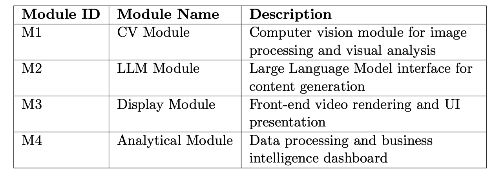
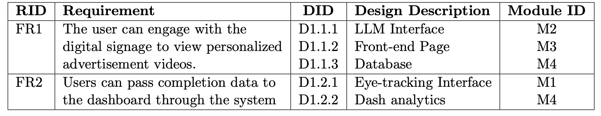
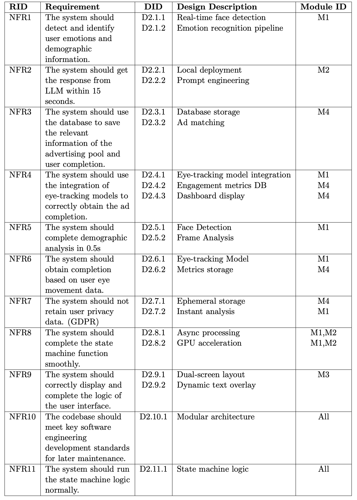
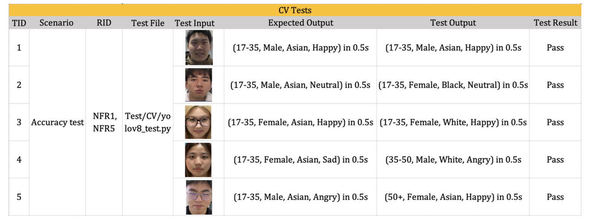
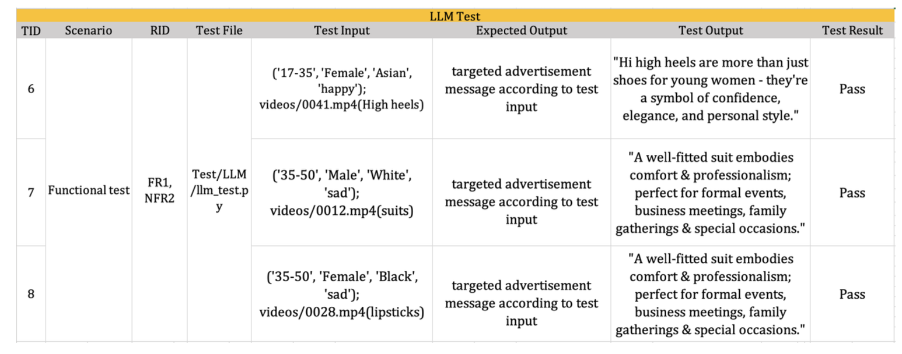
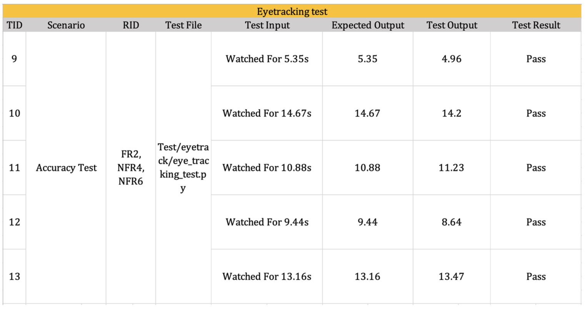
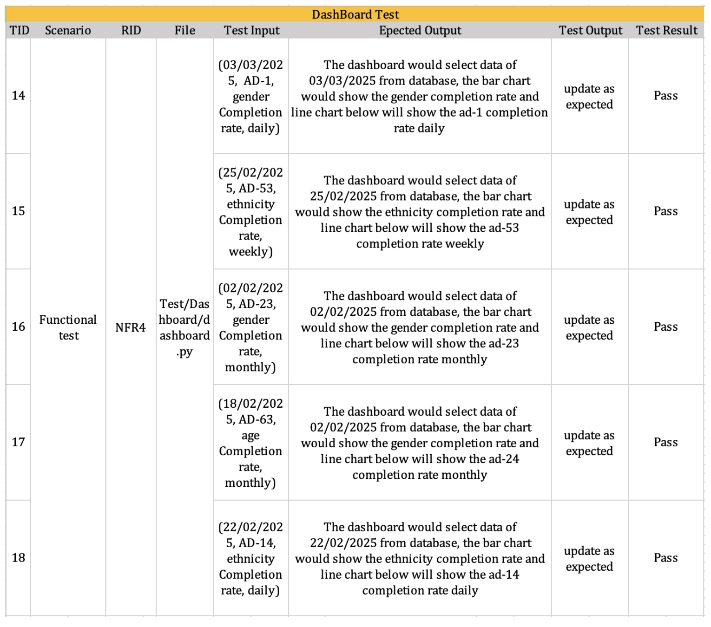
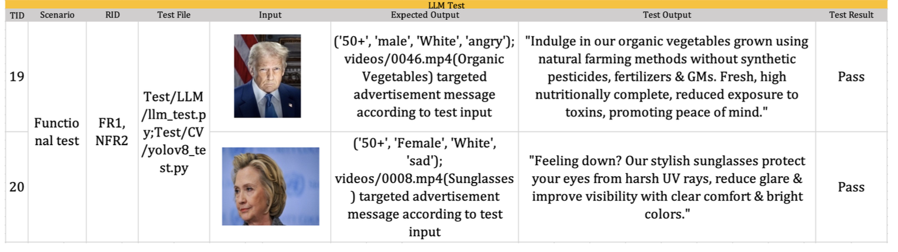
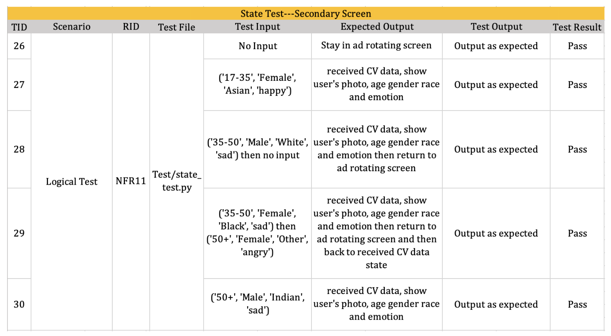

# AI-Powered Digital Signage

This repo is for [P2024‑08] AI‑Powered Digital Signage for Targeted and Personalized Advertisement.

## Introduction
This project aims to develop an AI digital signage capable of collecting users' facial and emotional data via a camera, enabling the recommendation of personalized advertisements tailored to individual preferences, thereby enhancing the fluidity and comfort of the shopping experience for users.


## Start up the project

We have provided multiple entrance for user to execute the project.

In this project, we have provided a Huggingface Personal Token for Llama in `.env` for testing purpose, please do not disclose it to the public.

##### 1. For windows users:

Double click the `click_to_start/ai_digital_signage_win.exe` and input your camera index (0 is your default camera, 1 is external camera) immediately after seeing prompt in terminal:
 ```bash
Using device: cpu/cuda
cpu/cuda
Start up. Today's date is: <today's date>
 ```
Please reserve at least 5GB of available space on your hard drive. When running for the first time, the user need to wait the resources to be successfully downloaded.
##### 2. For Mac users:

Execute `click_to_start/ai_digital_signage_mac`.

However, the executable is typically recognized as a document when copying to a new Mac. In this case, please open a terminal in `click_to_start` and execute the following command in the terminal:

 ```bash
chmod +x ai_digital_signage_mac
 ```
This command will inform MacOS `ai_digital_signage_mac` as a executable file, then users can execute it by clicking or using the commands below in the terminal:
 ```bash
/dist/ai_digital_signage_mac; exit;
 ```
If a security warning is triggered and you are unable to open the file or camera permissions denied, please go to the system settings and trust the file under "Privacy \& Security" in the pop up window and run it again. 

Then, you will see the same prompt as for Windows users.

##### 3. To run the source code
Before get started, you may need to install PyTorch on your device: https://pytorch.org/.    
Upgrade pip with:   

 ```bash
pip install --upgrade pip
pip install --upgrade setuptools
 ```
Install transformer package with:
```bash
pip install transformers
```
Update related dependencies with:
```bash
pip install --upgrade torch pyinstaller onnxscript dash
```
If any problem occurs while installing dash:
```bash
pip install setuptools wheel
pip install dash --no-binary stringcase
```
You may need to install the required dependencies, execute the following command to install them in [requirements.txt](requirements.txt).
```bash
pip install -r requirements.txt
```
If you fail to handle the conflict of environment dependency on your local PC, user are reconmended to use `conda` to create a virtual environment or contact us: scyyl30@nottingham.edu.cn.

Now you could run the program with:

```bash
python state.py
```
A token for the LLM model Llama-3.2-1B-Instruct is required, we provide you an available Hugging Face token in the .env file.   
You may need VPN to login the Hugging Face for the first time.
***
 The default camera is assigned the index 0. If you have an external camera, please enter 1, you can enter the index according to your requirement.
```bash
python state.py 
Using device: cpu
cpu
Start up. Today's date is: 2025-03-24
Input camera index: 
```
It will open flask app to display the digital signage screen of the project automatically. In order to get a better using experience, we strongly recommand you to use full screen mode in your browser.

The system acquires access to the camera resource, it will immediately initiate face detection and retrieve facial and emotional data.
```bash
0: 384x640 1 face, 303.1ms
Speed: 16.6ms preprocess, 303.1ms inference, 22.1ms postprocess per image at shape (1, 3, 384, 640)
[CV] Predicted Demographics: ('17-35', 'Male', 'Asian', 'sad')
[CV] Putting to detected_face_queue...
[State] LLM Processing: Generating ad text.
```
Three browser windows will show up as below: 

- **Digital signage screen** will display advertisements and show to the users.
- **Backend screen** will display the analysis results.
- **Dashboard** will display the watching data for the stakeholder. The watch time is accumulated only when **Digital signage screen** gains the focus in **Targeted AD Displaying** state, where the process is also informed in terminal output. You may click refresh button to update the newly arrived data on the dashboard.

#### Main Screen
- Ad rotating state: randomly display advertisements


- Targeted video displaying state: display personalized advertisements according to the demographic data and emotional data


#### Secondary screen
- Ad rotating state: no face detected


- Targeted video displaying state: display demographic data and emotional data analyze result


#### Dashboard


#### If you have any confusion about the project, please contact us:

scyyl30@nottingham.edu.cn

scyal8@nottingham.edu.cn


## Quality Assurance

The system contains four main Modules, they are:



The functional requirements are identified as:



- RID: Requirement ID
- FR: Functional Requirement

The non-functional requirements are identified as:



- RID: Requirement ID
- NFR: Non-functional Requirement

The team conducted Unit Tests, they are:









The team conducted Integration and System Tests, they are:





Hence, the team ensured all requirements have been testified and satisfied.


## Appendix

### Use Case Diagram For The System 


## License

Click here to see [Licenses](LICENSE).
