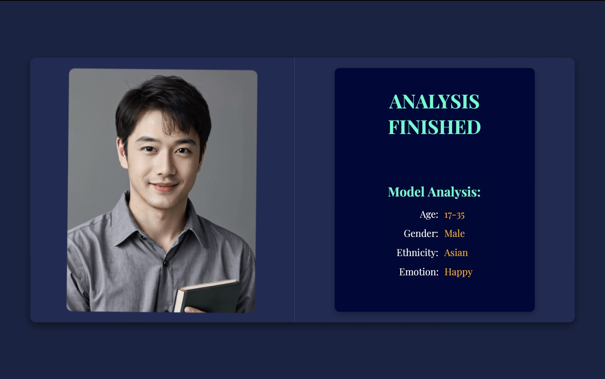
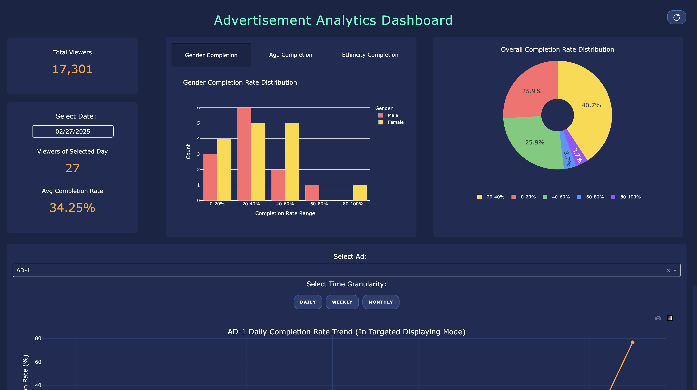
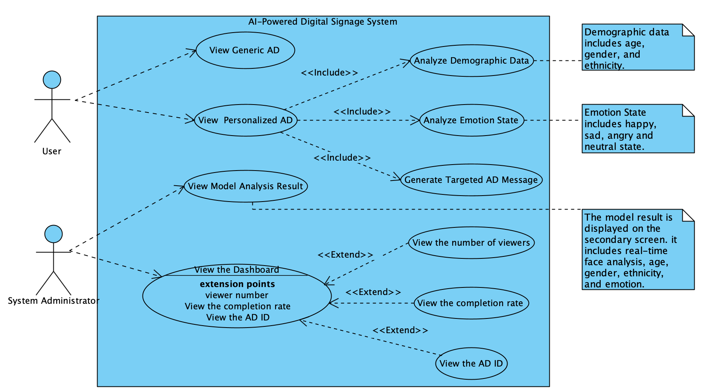

# AI-Powered Digital Signage
This repo is for [P2024‑08] AI‑Powered Digital Signage for Targeted and Personalized Advertisement.

## Introduction
This project aims to develop an AI digital signage capable of collecting users' facial and emotional data via a camera, enabling the recommendation of personalized advertisements tailored to individual preferences, thereby enhancing the fluidity and comfort of the shopping experience for users.

## Start up the project
#### We have provided multiple entrance for user to execute the project
##### 1. For windows users:
Double click the ai_digital_signage_win.exe file and input your camera index(0 is your default camera, 1 is external camera) immediately after the 
 ```bash
Using device: cpu/cuda
cpu/cuda
Start up. Today's date is: <today's date>
```
prompt shows up.  Please reserve at least 5GB of available space on your hard drive. When running for the first time, just after observing that the global tokenizer is loaded to 100\%, immediately enter 0 and press Enter and wait for the program to run.
##### 2. For Mac users:
Mac users should download our ai_digital_signage_mac executable file; however, it is typically recognized as a document. In this case, please refrain from opening it. Instead, in the current directory, execute the following command in the terminal:
 ```bash
chmod +x ai_digital_signage_mac
```
This command will extract it as a executable file, then users can execute it by clicking  or using the commands below in the terminal:
 ```bash
/dist/ai_digital_signage_mac; exit;
```
If a security warning is triggered and you are unable to open the file, please go to the settings and trust the file under "Privacy \& Security" . 
##### 3. To run the source code
Before get started, you may need to install PyTorch on your device:https://pytorch.org/.    
Upgrade pip with:   
 ```bash
pip install --upgrade pip
pip install --upgrade setuptools
```
Install transformer package with:
```bash
pip install transformers
```
Update related dependencies with:
```bash
pip install --upgrade torch pyinstaller onnxscript dash
```
If any problem occurs while installing dash:
```bash
pip install setuptools wheel
pip install dash --no-binary stringcase
```
You may need to install the required dependencies, execute the following command to install them in [requirements.txt](requirements.txt).
```bash
pip install -r requirements.txt
```
Now you could run the program with:
```bash
python state.py
```
A token for the LLM model Llama-3.2-1B-Instruct is required, we provide you an available Hugging Face token in the .env file.   
You may need VPN to login the Hugging Face for the first time.
***
 The default camera is assigned the index 0. If you have an external camera, please enter 1, you can enter the index according to your requirement.
```bash
python state.py 
Using device: cpu
cpu
Start up. Today's date is: 2025-03-24
Input camera index: 
```
It will open a port to display the frontend components of the project automatically. In order to get a better using experience, we strongly recommand you to use full screen mode.

The system acquires access to the camera resource, it will immediately initiate face detection and retrieve facial and emotional data.
```bash
0: 384x640 1 face, 303.1ms
Speed: 16.6ms preprocess, 303.1ms inference, 22.1ms postprocess per image at shape (1, 3, 384, 640)
[CV] Predicted Demographics: ('17-35', 'Male', 'Asian', 'sad')
[CV] Putting to detected_face_queue...
[State] LLM Processing: Generating ad text.
```
Three browser windows will show up as below: 

- Main screen will display advertisements and show to the users.
- Secondary screen shows the demographic data, emotion data and user's image.    
- Dashboard is to show the watching data for the stakeholder. The watch time is recorded only when the user focuses on the main screen. You may click refresh button to update the newly arrived data on the dashboard.

#### Main Screen
- Ad rotating state: randomly display advertisements


- Targeted video displaying state: display personalized advertisements according to the demographic data and emotional data


#### Secondary screen
- Ad rotating state: no face detected


- Targeted video displaying state: display demographic data and emotional data analyze result



#### Dashboard


#### If you have any confusion about the project, please contact us:
scyal8@nottingham.edu.cn

## Appendix
### Use Case Diagram For The Program



### License

Click here to see [Licenses](LICENSE).
